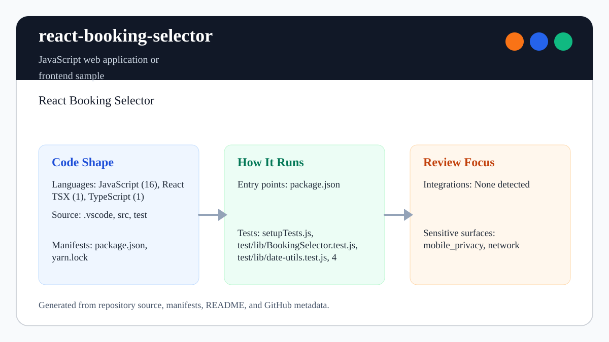

# React Booking Selector



`react-booking-selector` is a controlled React component for selecting date and time slots on a day-by-hour booking grid. It supports blocked slots, square or linear drag selection, keyboard navigation, custom colors, and custom cell rendering.

## Getting Started

```bash
yarn add react-booking-selector styled-components
```

TypeScript declarations are included for both the default export and the named `BookingSelector` export.

The package exposes a root `exports` map with CommonJS and ESM entry points, and keeps `main`, `module`, and `types` fields for compatibility. Supported peer dependency majors are React 18 or 19, React DOM 18 or 19, and styled-components 5 or 6.

```js
import React, { useState } from 'react'
import BookingSelector from 'react-booking-selector'
// Or: import { BookingSelector } from 'react-booking-selector'

const blocked = []

function App() {
  const [selection, setSelection] = useState([])

  return (
    <BookingSelector
      selection={selection}
      blocked={blocked}
      numDays={5}
      minTime={8}
      maxTime={22}
      onChange={setSelection}
    />
  )
}
```

## Component Behavior

`BookingSelector` is controlled. Pass `selection`, `blocked`, and `onChange`; the component renders the grid and reports the next selection when the user finishes a click, drag, tap, touch drag, or keyboard toggle.

Selection schemes:

- `square` selects a rectangular block between the start and end cells.
- `linear` selects every chronological slot between the start and end cells.

Each time slot is rendered as a native button. Blocked slots are disabled and removed from the tab order. Arrow keys move focus between adjacent slots, and `Enter` or `Space` toggles the focused slot. Slots expose accessible labels that include their selected, blocked, or available state plus the full date and hour.

If the same slot appears in both `selection` and `blocked`, blocked state takes precedence. The slot renders as unavailable, is exposed as unpressed to assistive technology, and is not carried into the next selection emitted by `onChange`.

## Custom Cell Rendering

Use `renderDateCell` when a slot needs custom content. The outer grid cell still owns pointer, touch, keyboard, focus, and accessibility behavior, so custom content should be presentational rather than another interactive control.

```js
const renderDateCell = (time, selected, blocked) => (
  <span className={`slot-content ${selected ? 'selected' : ''} ${blocked ? 'blocked' : ''}`}>
    {time.getHours()}:00
  </span>
)

<BookingSelector
  selection={selection}
  blocked={blocked}
  renderDateCell={renderDateCell}
  onChange={setSelection}
/>
```

## Date and Time Behavior

`BookingSelector` uses JavaScript `Date` values in the runtime's local timezone. The `startDate` time portion is ignored, and the grid starts at local midnight for that date. If `startDate` is omitted or invalid, the grid starts from today. `minTime` and `maxTime` are local 24-hour clock values from `0` to `23`.

Values in `selection` and `blocked` may be `Date` objects, timestamps, date strings, date-like objects with a numeric `valueOf()`, `null`, or `undefined`, and are normalized to `Date` objects before comparison. Nullish, invalid, or malformed date values are ignored. Valid values are matched to grid slots at minute precision. For predictable results, prefer `Date` objects that represent the same local timezone and hour/minute values as the rendered grid.

## Props

### `selection`

**type**: `Array<Date | string | number | { valueOf(): number } | null | undefined>`

**description**: List of date/times that should be selected in the grid. Values should reflect the start time of each selected slot.

**required**: no

**default value**: `[]`

### `blocked`

**type**: `Array<Date | string | number | { valueOf(): number } | null | undefined>`

**description**: List of date/times that should be unavailable to select.

**required**: no

**default value**: `[]`

### `selectionScheme`

**type**: `'square' | 'linear'`

**description**: Drag-selection behavior. `square` selects a block with the start and end cells at opposite corners. `linear` selects all slots chronologically between the start and end cells.

**required**: no

**default value**: `'square'`

### `onChange`

**type**: `(selection: Date[]) => void`

**description**: Called when selected availability changes. The new selected dates are passed as the first argument.

**required**: no

**default value**: no-op function

### `startDate`

**type**: `Date`

**description**: The date on which the grid should start. The time portion is ignored; specify the visible hours with `minTime` and `maxTime`.

**required**: no

**default value**: today

### `numDays`

**type**: `number`

**description**: Number of days to show, starting from `startDate`.

**required**: no

**default value**: `7`

### `minTime`

**type**: `number`

**description**: Minimum whole hour to show, from `0` to `23`. Slots render only when `minTime` and `maxTime` are whole hours in that range and `maxTime` is greater than or equal to `minTime`.

**required**: no

**default value**: `9`

### `maxTime`

**type**: `number`

**description**: Maximum whole hour to show, from `0` to `23`. Slots render only when `minTime` and `maxTime` are whole hours in that range and `maxTime` is greater than or equal to `minTime`.

**required**: no

**default value**: `23`

### `dateFormat`

**type**: `string`

**description**: date-fns `format` token string used for column headers.

**required**: no

**default value**: `'d'`

### `margin`

**type**: `number`

**description**: Margin between grid cells in pixels.

**required**: no

**default value**: `3`

### `unselectedColor`

**type**: `string`

**description**: Color of an unselected cell.

**required**: no

**default value**: `'#dbedff'`

### `selectedColor`

**type**: `string`

**description**: Color of a selected cell.

**required**: no

**default value**: `'rgba(89, 154, 242, 1)'`

### `hoveredColor`

**type**: `string`

**description**: Color of a hovered cell.

**required**: no

**default value**: `'rgba(162, 198, 248, 1)'`

### `blockedColor`

**type**: `string`

**description**: Color of a blocked cell.

**required**: no

**default value**: `'rgba(79, 79, 79, 1)'`

### `renderDateCell`

**type**: `(time: Date, selected: boolean, blocked: boolean) => React.ReactNode`

**description**: Optional render prop for custom slot content. The outer grid cell still supplies selection handlers, keyboard handlers, and accessibility attributes. Color props do not affect custom cell content.

**required**: no

**default value**: default colored cell

## Development

```bash
corepack yarn verify
corepack yarn build
```

`corepack yarn verify` runs linting, TypeScript checks, Jest with coverage thresholds, a dependency audit, and a package dry run. The package intentionally publishes `dist/lib`, `dist/esm`, `docs/readme-overview.svg`, `README.md`, and `LICENSE`.
